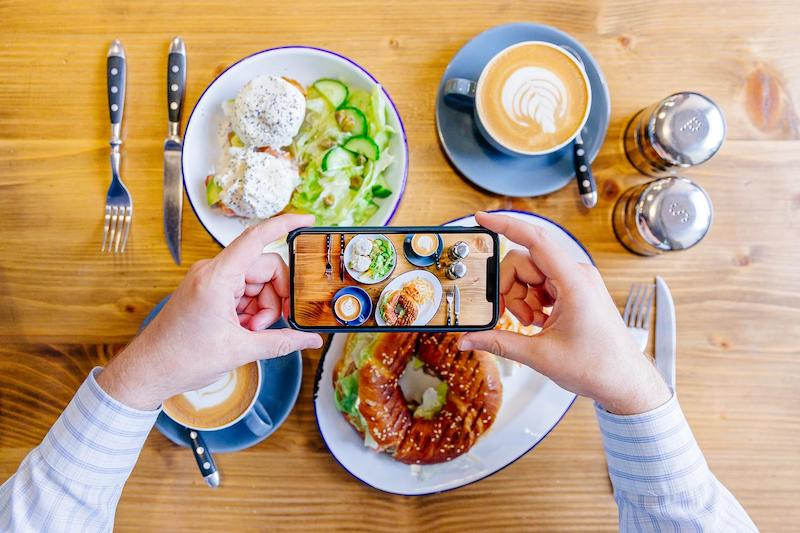

<h1><B><U> CNN BASED FOOD RECOGNITION </B></U> </h1>

<h2> Basic Idea behind thi project:</h2>
We propose a food image recognition system with convolutional neural networks(CNN), which has been applied to image recognition successfully in the literature. The system uses image processing and computational intelligence for food item recognition. A large, deep convolutional neural network is trained to classify more than a 1000 high-resolution images of each category.

<B> Process to execute: </B>

- Upload the .ipynb file on Google Colab.
- Run the first cell, and authorize the good drive the kaggle folder.
- After running the cells which import the libraries, scroll down and continue running the cells from where it's instructed. 
- The model takes several hours to run hence the model is saved, and continue your work using the imported model.
- Upload the image in jpg or jpeg format in the test/test1 folder.
- Run the final cell to let the model recognize the food item.

<B> ATTENTION!: Careful with the format of the photo, if its in .jpg format, check the function plot_pred_final(image_path_custom) [3rd last code section] 
            else if the image is in .jpeg format, do edit accordingly: </B>
            

           
OUTPUT:

